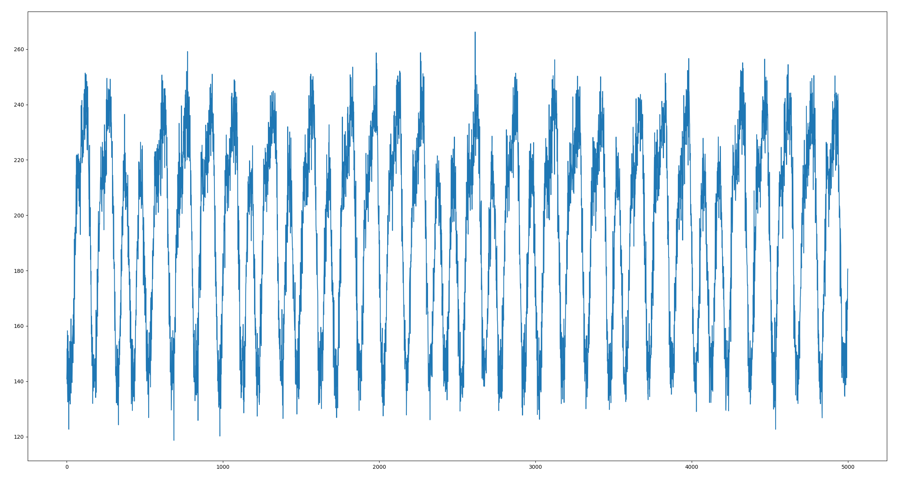

# Behind Enemy Lines: Power Trip

## De Danske Cybermesterskaber 2022 - Nationals

Arstotzka has declared war on our peaceful Kolechia and sent soldiers into our country.
Our spies behind enemy lines have gained access to a high security military base.
With a network sniffer they have intercepted network traffic which we hope contains information on where Arstotzka will strike next.

Most of the traffic is encrypted and we don't have access to their private key.
One of our spies has, however, succeeded in bringing a ChipWhisperer board into the internal web server of the base, and we got a power trace of a decryption during a TLS handshake. This is a visual sample from the trace:

The entire power trace can be found [here](trace.npy) together with the [packet capture](sniffed.pcapng).
Help us stop Arstotzka and bring back peace to our nations!

## Original (Danish)

Arstotzka har erklæret vores fredelige Kolechia krig og har sendt soldater ind i vores land.
Vores spioner bag fjendens linjer har skaffet sig adgang til en topsikret militær base i Arstotzka.
Med en netværkssniffer har de opsnappet en mængde netværkstraffik, vi håber indeholder information om, hvor de vil ramme os næste gang.

Det meste af traffikken er krypteret, og vi har ikke adgang til deres private nøgle. Det er dog lykkedes vores folk at få et ChipWhisperer board på basens interne webserver, og vi har fået en måling af dens strømforbrug under en dekryptering ved et TLS handshake. Her er et visuelt sample fra målingen:

Hele power tracen kan findes [her](trace.npy) sammen med [packet capture](sniffed.pcapng) filen.
Hjælp os med at stoppe Arstotzka og genoprette freden!
