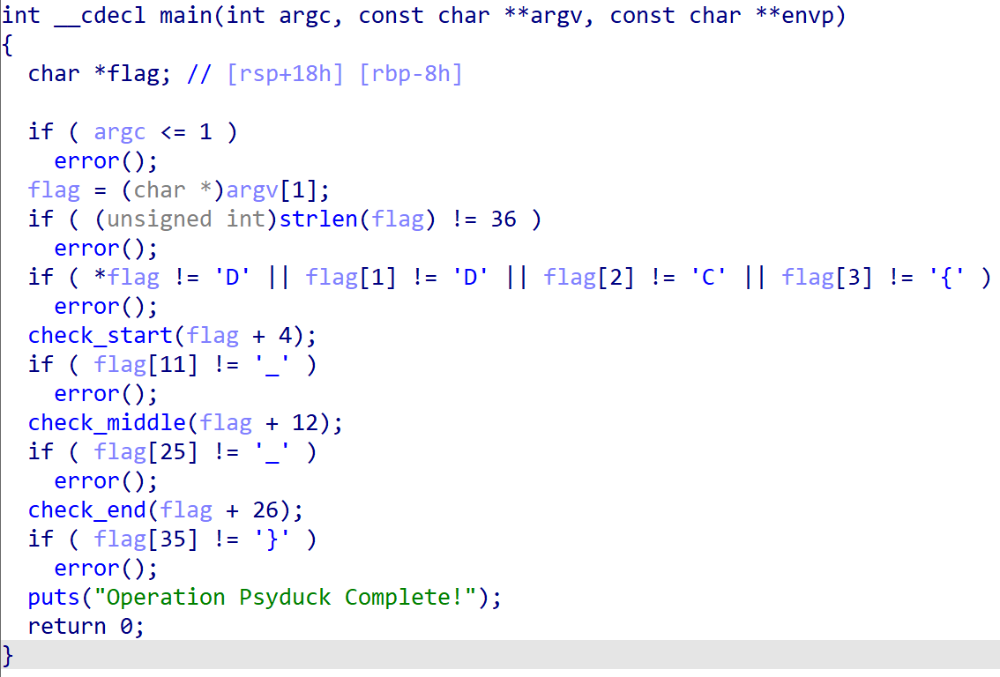
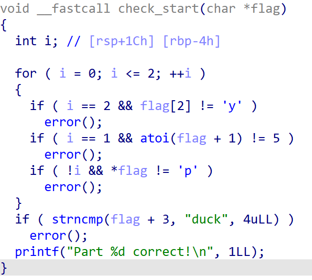
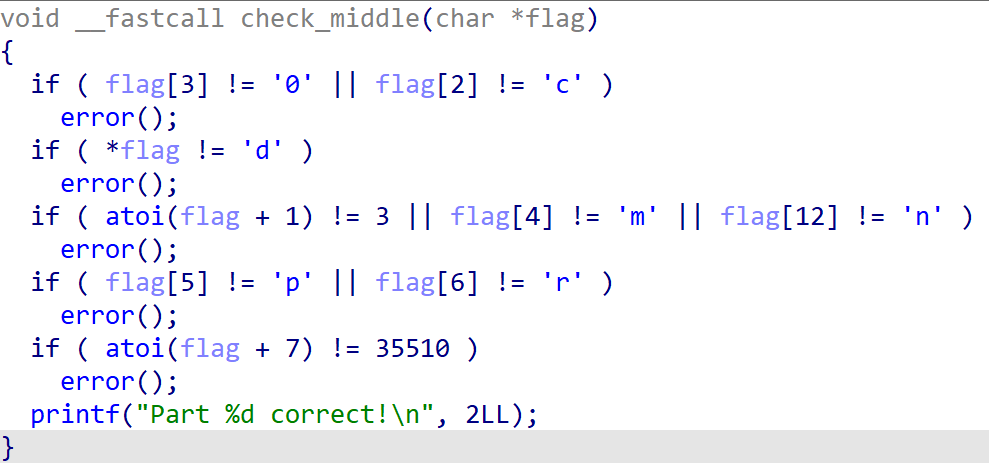
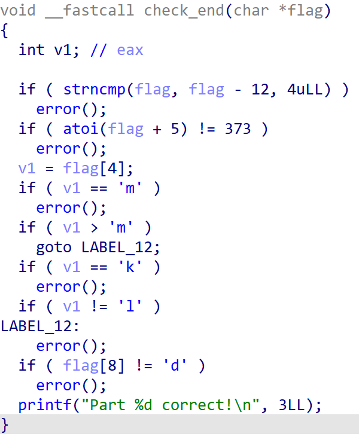
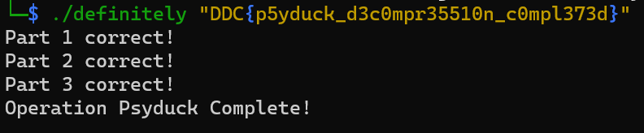

# Writeup

Source code is provided but quite obfuscated due to all the defines and the code being structured as Psyduck.

An easy solution is to compile the binary in a way that makes it easy to reverse again:
```
$ gcc -o definitely -gdwarf-4 -no-pie -O0 definitely.c
```
Opening this binary in a decompiler such as IDA Free makes it quite easy to read - now well structured and all arithmetic has been inlined etc.

Should be simple to reverse from here, but there is a length check (flag length 36), a check for the flag format and for underscores and then a function for each word in the flag between the underscores:



First check ensures the first word starts with `p5y` and ends with `duck`:



Second check ensures the second word is `d3c0mpr35510n` through some character checks and decimal checks (so e.g. checks that position 7 contains decimal number 35510):



Third check ensures the third and last word is `c0mpl373d` by comparing `c0mp` to position 2 in `d3c0mpr35510n`, and then checks for characters `l` and `d` and decimal `373`:



This results in `DDC{p5yduck_d3c0mpr35510n_c0mpl373d}`, which can then be validated against the binary:



## Flag

`DDC{p5yduck_d3c0mpr35510n_c0mpl373d}`
